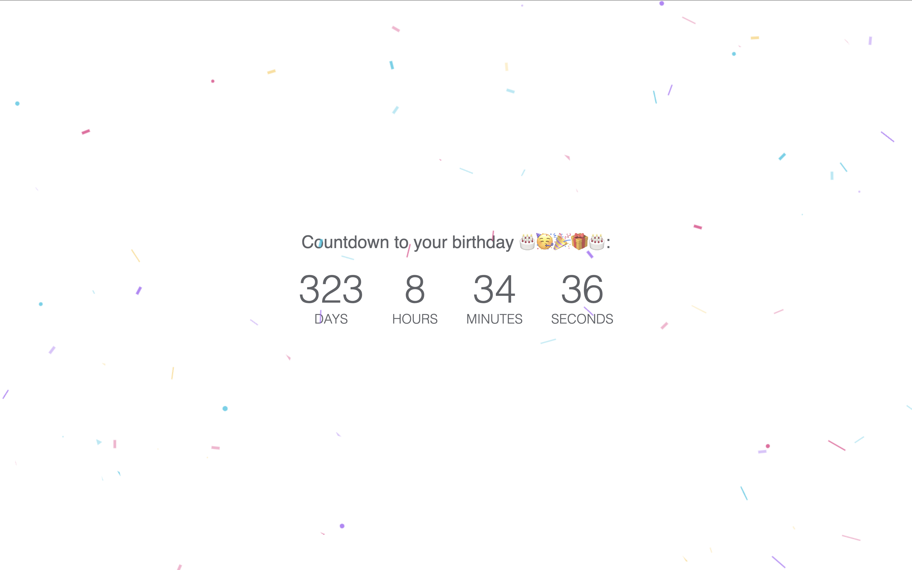
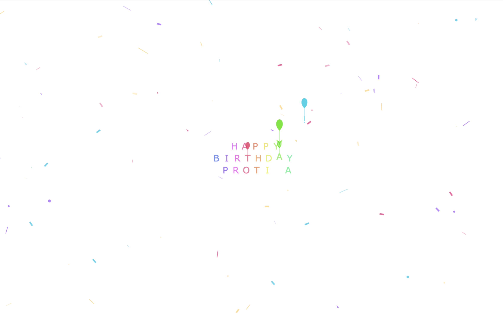
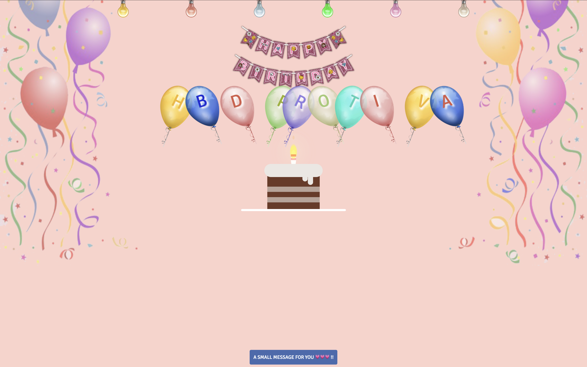

# Birthday Celebration Website 🎉🎂  

An interactive and vibrant website created using HTML, CSS, and JavaScript to celebrate the birthday of someone special. Featuring animations, countdowns, balloons, cake, candles and colorful confetti to create a joyful experience.

  
  
  

## Features
- **Happy Birthday Animation:** Displays a colorful "Happy Birthday" greeting with confetti effects.  
- **Countdown Timer:** A dynamic countdown to the next birthday.  
- **Interactive Design:** Fun and engaging visuals with smooth animations.
- **Special Message:** Write a special message for your loved one.
- **Birthday Celebration:** Celebrate the birthday of your loved one in a special way with candles, balloons, cake, and special animations.

## Live Preview
Check out the live version here: [Live Preview](http://hbdprotiva.42web.io/)

## Installation
1. Clone the repository:
   ```bash
   git clone https://github.com/nouzen-shinei/birthday-wish.git
